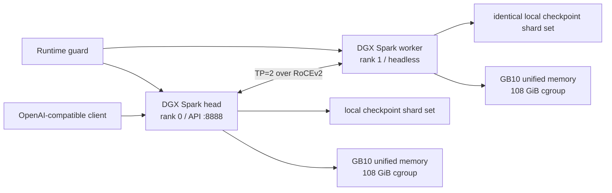

# DeepSeek V4 Flash on 2× DGX Spark

[](https://github.com/cyijun/deepseek-v4-flash-dgx-spark-tp2/actions/workflows/validate.yml)
[](https://github.com/cyijun/deepseek-v4-flash-dgx-spark-tp2/actions/workflows/build-container.yml)

在两台 NVIDIA DGX Spark（GB10 / SM121）上以 **TP=2、PP=1** 部署 DeepSeek-V4-Flash 的可复现工程。仓库包含：

- 基于 vLLM 0.27.1 的 ARM64 容器打包 Action；
- 面向 RoCE 双机 TP=2 的启动、监控和停止脚本；
- 官方 FP8/MXFP4 checkpoint 与 NVFP4 checkpoint 两套 preset；
- 真实 packed NVFP4 DS-MLA KV cache、FlashInfer B12X MoE 的源码契约；
- 从 mock bring-up 到完整 48-shard checkpoint 的结构化实验记录；
- 与 Anemll `dspark-vllm-gx10` 记录的性能对比和负面结果。

模型权重、Hugging Face token、机器日志、原始 profiler trace 和容器 inspect dump不进入本仓库。

## 当前结论

1. 完整 48-shard NVFP4 checkpoint 已在双机 TP=2 跑通，target 使用 FlashInfer B12X，KV 使用真实 288-byte packed NVFP4 DS-MLA row。
2. NVFP4 权重不代表 decode 阶段必须 W4A4。当前 C6 小 M 场景中，保留 packed NVFP4 权重但用 B12X W4A16 计算比动态 W4A4 更快。
3. 与 Anemll 最可比的 official-checkpoint hot control 为 **97.20 output tok/s**；Anemll 记录为 **108.18 tok/s**。差距同时包含 5.82% 的接受率差异和 4.82% 的 target-iteration 时间差异。
4. phase-aligned profile 中，当前 B12X、MHC 和 sparse MLA decode kernel 并不慢于 Anemll。已定位并消除一个独立的 shared-expert route `torch.cat` 热点，路由微基准降低约 59%。
5. 优化后镜像尚无完整 TP=2 C6 吞吐结果：启动时 swap 增长达到 654 MiB，安全保护按 512 MiB 阈值主动停止。因此本仓库不声称端到端提速。

完整证据见 [HTML 技术报告](reports/flow-comparison-report.html)、[实验时间线](docs/experiments.md) 和 [机器可读尝试记录](data/attempts.json)。

## 源码联动

部署仓库不复制维护定制框架源码，而是在构建时 checkout 以下固定 commit：

- vLLM：[cyijun/vllm@7e64417](https://github.com/cyijun/vllm/commit/7e64417e4af6d0079a0a9bfb999dd667f7263a58)
  （[开发分支](https://github.com/cyijun/vllm/tree/feat/deepseek-v4-nvfp4-ds-mla)）
- FlashInfer：[cyijun/flashinfer@6398edb](https://github.com/cyijun/flashinfer/commit/6398edbbc6796d81781bd54827be860b65d8f38b)
  （[开发分支](https://github.com/cyijun/flashinfer/tree/agent/apply-swiglu-limit-to-silu-b12x)）

完整 commit 角色和回退尝试见 [源码版本契约](docs/source-contract.md)。固定版本保存在 [config/versions.env](config/versions.env)，容器 image label 也记录两个 commit，部署前会在两台机器上校验。

## 执行拓扑



两台机器必须拥有相同模型 snapshot revision 和相同镜像。模型缓存是节点本地路径，不是假定的共享文件系统。

## 快速开始

### 1. 配置节点和模型

```bash
cp config/deployment.env.example config/deployment.env
$EDITOR config/deployment.env
```

启动前脚本要求两端：

- `MemAvailable >= 110 GiB`；
- 相同的 48 个 weight shard 和 snapshot revision；
- RoCEv2 链路为 `ACTIVE`；
- 镜像内 vLLM / FlashInfer commit 与版本契约一致；
- 没有同名残留容器。

### 2. 获取镜像

推荐从 GitHub 的 **Package ARM64 runtime** workflow 手动构建并推送 GHCR，然后将不可变 digest 写入 `config/deployment.env`。

本机构建：

```bash
./scripts/build-image.sh
```

该脚本会从你的两个 fork 拉取固定 commit。也可以通过 `VLLM_SOURCE` 和 `FLASHINFER_SOURCE` 指向已有的干净 checkout。

### 3. 启动 TP=2

官方 checkpoint，物理 FP8 DS-MLA KV，target/draft 均为 B12X W4A16：

```bash
MODEL_REPO=/path/to/official/cache ./scripts/deploy-official.sh
```

NVFP4 checkpoint，packed NVFP4 DS-MLA KV，B12X W4A16 target：

```bash
MODEL_REPO=/path/to/nvfp4/cache \
MODEL_REV=<snapshot-commit> \
./scripts/deploy-nvfp4.sh
```

服务健康后，另开终端持续运行保护器：

```bash
./scripts/runtime-guard.sh
```

停止：

```bash
./scripts/stop.sh
```

## 不可放宽的容量边界

- TP=2，PP=1；
- 最大并发 C6，不支持 C128；
- 固定 6 GiB KV cache / node；
- Docker `--memory 108g --memory-swap 108g`；
- 运行时 `MemAvailable` 不得低于 10 GiB；
- 相对启动基线 swap 增长不得超过 512 MiB。

DGX Spark 的 GPU 和 CPU 共用系统 DRAM。`nvidia-smi` 的传统显存视图不能替代 `/proc/meminfo` 和 cgroup 保护。详见 [统一内存安全策略](docs/memory-safety.md)。

## 仓库结构

| 路径 | 内容 |
| --- | --- |
| `.github/workflows/build-container.yml` | 自托管 ARM64 runner 上构建、签名并推送 GHCR |
| `container/` | 基于 vLLM 0.27.1 ARM64 镜像的源码 overlay 配方 |
| `scripts/` | 构建、TP=2 部署、运行保护、诊断和微基准 |
| `config/` | 固定源码版本和本地部署配置模板 |
| `data/` | 尝试状态、benchmark 汇总、phase-aligned profile 数据 |
| `docs/` | 架构、实验时间线、版本契约、安全和复现说明 |
| `reports/` | 自包含 HTML 技术报告及其 source artifact |

## 文档入口

- [推理与构建架构](docs/architecture.md)
- [完整实验过程](docs/experiments.md)
- [源码版本契约](docs/source-contract.md)
- [统一内存安全策略](docs/memory-safety.md)
- [端到端复现步骤](docs/reproduction.md)

## 适用范围

这是针对 DGX Spark / SM121 / 双机 RoCE TP=2 的工程记录，不是 vLLM 或 FlashInfer 上游支持声明。报告中的跨 runtime 数字是系统级对照，不是单 kernel 因果 A/B。
