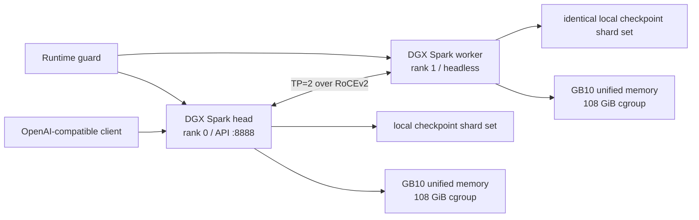

# DeepSeek V4 Flash on 2× DGX Spark

**English** | [简体中文](README.zh-CN.md)

[](https://github.com/cyijun/deepseek-v4-flash-dgx-spark-tp2/actions/workflows/validate.yml)
[](https://github.com/cyijun/deepseek-v4-flash-dgx-spark-tp2/actions/workflows/build-container.yml)

## Deployment guide

This repository deploys DeepSeek-V4-Flash across exactly **two NVIDIA DGX
Spark systems (GB10 / SM121) with TP=2 and PP=1**. Run the commands below on
the head node; the scripts start and manage rank 1 over SSH.

> [!CAUTION]
> DGX Spark uses unified CPU/GPU memory. Do not start the service unless both
> nodes have at least 110 GiB of `MemAvailable`, and keep the runtime guard
> running after startup. The validated configuration is limited to C6 and a
> 6 GiB KV cache per node. Raising these limits can make both hosts
> unresponsive.

### Two supported checkpoint variants

The same published image supports both the **original official checkpoint**
and an **NVFP4 checkpoint**. Select the matching launcher; do not mix one
checkpoint's KV layout or quantization settings with the other profile.

| Profile | Model weights | MLA KV cache | Expert execution | Launcher |
| --- | --- | --- | --- | --- |
| Original / official | `deepseek-ai/DeepSeek-V4-Flash-0731`: FP8 dense/linear weights and native MXFP4 routed experts | `fp8_ds_mla`, physical FP8 layout, 584 B/token | B12X W4A16 target and draft | [`deploy-official.sh`](scripts/deploy-official.sh) |
| NVFP4 | DeepSeek-V4-Flash-compatible NVFP4 checkpoint, including its MTP structure and quantization metadata | `nvfp4_ds_mla`, real packed NVFP4 layout, 288 B/token | B12X W4A16 target; Marlin draft by default, optionally B12X | [`deploy-nvfp4.sh`](scripts/deploy-nvfp4.sh) |

For the NVFP4 profile, the weights remain packed in NVFP4 storage while the
validated small-M decode path executes target experts as W4A16. This was
measured faster than dynamic W4A4 at C6; it does not turn the checkpoint or
the 288-byte KV layout into FP16.

### 1. Prerequisites

- Two aarch64 DGX Spark systems on the same RoCEv2 network;
- Ubuntu 24.04, Docker, NVIDIA Container Toolkit, and `/dev/infiniband` on both
  nodes;
- passwordless SSH from the head to the worker, with permission to run Docker;
- the same immutable Hugging Face model snapshot at the same absolute path on
  both nodes, containing `config.json` and 48 `model*.safetensors` shards;
- at least 110 GiB of `MemAvailable` on each node before startup.

Do not deploy while another model server, image build, or other memory-heavy
job is running. Verify both hosts first:

```bash
awk '/MemAvailable|SwapTotal|SwapFree/ {print}' /proc/meminfo
ssh user@dgx-spark-worker.local \
  "awk '/MemAvailable|SwapTotal|SwapFree/ {print}' /proc/meminfo
docker ps
ssh user@dgx-spark-worker.local docker ps
```

### 2. Clone and configure

```bash
git clone https://github.com/cyijun/deepseek-v4-flash-dgx-spark-tp2.git
cd deepseek-v4-flash-dgx-spark-tp2
cp config/deployment.env.example config/deployment.env
$EDITOR config/deployment.env
```

At minimum, set the following values in `config/deployment.env`:

| Variable | Meaning |
| --- | --- |
| `WORKER_HOST` | Passwordless SSH target for the worker |
| `HEAD_IP`, `WORKER_IP` | RoCEv2 addresses used by distributed vLLM |
| `NIC`, `HCA` | RoCE network interface and RDMA device |
| `MODEL_REPO` | Identical Hugging Face cache repository root on both nodes |
| `MODEL_REV` | Immutable snapshot commit; required by the NVFP4 preset |
| `IMAGE` | The immutable GHCR image digest below |

The checked-in template already pins the validated memory limits and image:

```text
IMAGE=ghcr.io/cyijun/deepseek-v4-flash-dgx-spark-tp2@sha256:f9724fb4a7feef44b83f32c10bc8826153eb2da000d1a0e5767f547c771cf444
PULL_IMAGE=1
```

With `PULL_IMAGE=1`, the deployment script pulls this ARM64 image on both
nodes. To pull it manually:

```bash
source config/deployment.env
docker pull "$IMAGE"
ssh "$WORKER_HOST" docker pull "$IMAGE"
```

### 3. Start TP=2

Choose exactly one of the following checkpoint profiles.

For the official DeepSeek-V4-Flash checkpoint with physical FP8 DS-MLA KV and
B12X W4A16 target/draft experts:

```bash
MODEL_REPO=/same/path/on/both/nodes/models--deepseek-ai--DeepSeek-V4-Flash-0731 \
  ./scripts/deploy-official.sh
```

`deploy-official.sh` defaults to the validated snapshot revision
`9e165c30e2704aec5d9d593cce3eebd58bbef1cb`.

For an NVFP4 checkpoint with packed NVFP4 DS-MLA KV and a B12X W4A16 target:

```bash
MODEL_REPO=/same/path/on/both/nodes/models--owner--nvfp4-model \
MODEL_REV=<immutable-snapshot-commit> \
  ./scripts/deploy-nvfp4.sh
```

Preflight checks reject mismatched shards, source labels, inactive RoCE links,
insufficient free memory, or stale containers. Startup can take up to 30
minutes on a cold JIT cache. On failure, bounded diagnostics are saved under
`logs/` and both containers are removed.

### 4. Keep the memory guard running

As soon as deployment reports healthy, keep this command running in a separate
terminal or under a supervisor such as `tmux`:

```bash
./scripts/runtime-guard.sh
```

The guard checks both nodes every two seconds. It captures logs and stops both
containers if `MemAvailable` drops below 10 GiB or swap grows by more than 512
MiB. The containers also have a hard 108 GiB memory/no-swap cgroup limit.

### 5. Verify the API

```bash
./scripts/status.sh
curl --fail http://127.0.0.1:8888/health
curl http://127.0.0.1:8888/v1/models
```

Official-checkpoint smoke test:

```bash
curl http://127.0.0.1:8888/v1/chat/completions \
  -H 'Content-Type: application/json' \
  -d '{
    "model": "deepseek-v4-flash-0731-vllm027",
    "messages": [{"role": "user", "content": "Explain tensor parallelism briefly."}],
    "max_tokens": 64,
    "temperature": 0
  }'
```

For the NVFP4 preset, use `deepseek-v4-flash-nvfp4`, or the value returned by
`/v1/models` if `SERVED_MODEL` was overridden.

### 6. Stop cleanly

```bash
./scripts/stop.sh
./scripts/status.sh
```

The validated safety envelope is TP=2, PP=1, maximum concurrency C6, maximum
model length 4096, and a fixed 6 GiB KV cache per node. See the
[unified-memory safety policy](docs/memory-safety.md) before changing any of
these limits.

## What this repository contains

This is a reproducible deployment and experiment repository for
DeepSeek-V4-Flash on two NVIDIA DGX Spark systems. It includes:

- an ARM64 container workflow based on vLLM 0.27.1;
- RoCE-aware TP=2 start, status, stop, and memory-guard scripts;
- presets for the official FP8/MXFP4 and custom NVFP4 checkpoints;
- source contracts for packed NVFP4 DS-MLA KV and FlashInfer B12X MoE;
- a structured history from mock-model bring-up to the complete 48-shard
  checkpoint;
- performance comparisons and negative results against Anemll
  `dspark-vllm-gx10`.

Model weights, Hugging Face tokens, host logs, raw profiler traces, and Docker
inspect dumps are intentionally excluded.

## Current findings

1. The complete 48-shard NVFP4 checkpoint runs successfully with TP=2. The
   target uses FlashInfer B12X, and KV uses a real packed 288-byte NVFP4 DS-MLA
   row.
2. NVFP4 storage does not require W4A4 execution during decode. At C6 and small
   M, retaining packed NVFP4 weights while using B12X W4A16 was faster than
   dynamic W4A4.
3. In the latest 180-second official-checkpoint C6 comparison, the customized
   runtime reached **106.39 output tok/s** on its first run versus Anemll's
   **106.07 tok/s**; the repeat reached **104.94 tok/s**. Target compute was
   faster in both runs, while end-to-end variation was dominated by
   speculative acceptance.
4. The main fixes chunk b12x 0.15.3 large-prefill launches to 1,024 routed rows
   and use the measured-faster `128×64/128-thread` W4A16 tile for C6 decode at
   M≤36. Estimated target batch iterations were 160.35 ms and 159.38 ms versus
   Anemll's 160.98 ms.
5. Phase-aligned profiles show that the current B12X, MHC, and sparse MLA
   decode kernels are not slower than Anemll's. Removing two `torch.cat`
   operations from shared-expert routing reduced the routing microbenchmark by
   about 59%.

See the [HTML technical report](reports/flow-comparison-report.html),
[experiment timeline](docs/experiments.md), and
[machine-readable attempt log](data/attempts.json) for the evidence.

## Source linkage

This repository does not duplicate the customized framework sources. The
container build checks out these immutable commits:

- vLLM: [cyijun/vllm@2db2051](https://github.com/cyijun/vllm/commit/2db20513ab9d73e61aecabb3ab83e8f60644718e)
  ([development branch](https://github.com/cyijun/vllm/tree/feat/deepseek-v4-nvfp4-ds-mla));
- FlashInfer: [cyijun/flashinfer@6398edb](https://github.com/cyijun/flashinfer/commit/6398edbbc6796d81781bd54827be860b65d8f38b)
  ([development branch](https://github.com/cyijun/flashinfer/tree/agent/apply-swiglu-limit-to-silu-b12x)).

The exact roles and fallback attempts are documented in the
[source-version contract](docs/source-contract.md). Pinned versions live in
[`config/versions.env`](config/versions.env), and the deploy preflight checks
the corresponding image labels on both nodes.

## Runtime topology



Each node uses its own local model cache; no shared filesystem is assumed.

## Building the image

Run the **Package ARM64 runtime** workflow to prepare and validate the
deterministic build context. Standard `ubuntu-24.04-arm` runners only have 14
GB of disk, while the base and final images expand to approximately 20.6 and
22.3 GB. The full Docker build therefore requires the trusted self-hosted DGX
Spark runner or an ARM larger runner with at least 150 GB of storage.

To build locally from the pinned forks:

```bash
./scripts/build-image.sh
```

Existing clean checkouts can be supplied with `VLLM_SOURCE` and
`FLASHINFER_SOURCE`.

## Repository layout

| Path | Purpose |
| --- | --- |
| `.github/workflows/build-container.yml` | Prepare the ARM64 context, build, sign, and publish GHCR images |
| `container/` | Source-overlay recipe based on the vLLM 0.27.1 ARM64 image |
| `scripts/` | Build, TP=2 deployment, runtime guard, diagnostics, and microbenchmarks |
| `config/` | Pinned source versions and the local deployment template |
| `data/` | Attempt status, benchmark summaries, and phase-aligned profiles |
| `docs/` | Architecture, experiment timeline, source contract, safety, and reproduction notes |
| `reports/` | Self-contained HTML technical report and source artifact |

## Documentation

- [Inference and build architecture](docs/architecture.md)
- [Complete experiment history](docs/experiments.md)
- [Source-version contract](docs/source-contract.md)
- [Unified-memory safety policy](docs/memory-safety.md)
- [End-to-end reproduction](docs/reproduction.md)

## Scope

This is an engineering record for DGX Spark, SM121, two-node RoCE, and TP=2;
it is not an upstream support statement from vLLM or FlashInfer. Cross-runtime
numbers in the report are system-level comparisons, not single-kernel causal
A/B tests.
