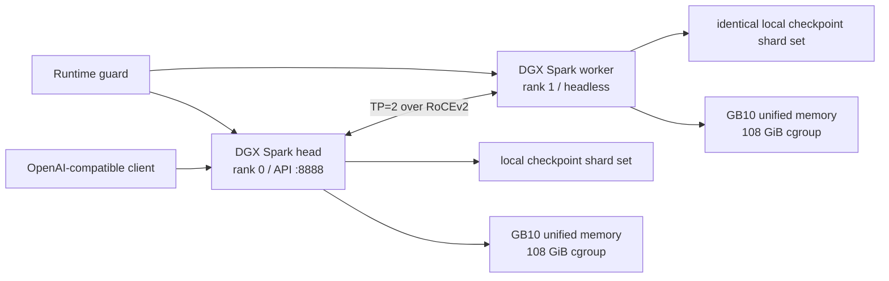

# 在 2 台 DGX Spark 上部署 DeepSeek V4 Flash

[English](README.md) | **简体中文**

[](https://github.com/cyijun/deepseek-v4-flash-dgx-spark-tp2/actions/workflows/validate.yml)
[](https://github.com/cyijun/deepseek-v4-flash-dgx-spark-tp2/actions/workflows/build-container.yml)

## 部署指南

本仓库用于在严格 **2 台 NVIDIA DGX Spark（GB10 / SM121）、TP=2、PP=1**
的配置下部署 DeepSeek-V4-Flash。以下命令只需在 head 节点执行，脚本会通过
SSH 启动和管理 worker 上的 rank 1。

> [!CAUTION]
> DGX Spark 的 CPU/GPU 共用统一内存。只有两台机器的 `MemAvailable`
> 都不少于 110 GiB 时才能启动，启动后必须持续运行内存保护器。已验证配置仅支持
> C6，每节点 KV cache 为 6 GiB。放宽这些限制可能导致两台主机失去响应。

### 支持的两种 checkpoint

同一个已发布镜像同时支持 **原版官方 checkpoint** 和 **NVFP4 checkpoint**。请为所用
checkpoint 选择对应的启动脚本，不要混用两套 profile 的 KV 布局或量化参数。

| Profile | 模型权重 | MLA KV cache | 专家计算 | 启动脚本 |
| --- | --- | --- | --- | --- |
| 原版 / 官方 | `deepseek-ai/DeepSeek-V4-Flash-0731`：FP8 dense/linear 权重和原生 MXFP4 routed experts | `fp8_ds_mla`，物理 FP8 布局，584 B/token | target 和 draft 均为 B12X W4A16 | [`deploy-official.sh`](scripts/deploy-official.sh) |
| NVFP4 | 具有完整 MTP 结构和量化元数据的 DeepSeek-V4-Flash 同结构 NVFP4 checkpoint | `nvfp4_ds_mla`，真实 packed NVFP4 布局，288 B/token | target 为 B12X W4A16；draft 默认为 Marlin，可切换 B12X | [`deploy-nvfp4.sh`](scripts/deploy-nvfp4.sh) |

NVFP4 profile 中的权重仍以 packed NVFP4 形式存储，已验证的小 M decode 路径则以 W4A16
执行 target experts。这一路径在 C6 下实测比动态 W4A4 更快，但不会把 checkpoint 或
288-byte KV 物理布局变成 FP16。

### 1. 准备条件

- 两台位于同一 RoCEv2 网络的 aarch64 DGX Spark；
- 两端安装 Ubuntu 24.04、Docker、NVIDIA Container Toolkit，并存在
  `/dev/infiniband`；
- head 到 worker 免密 SSH，SSH 用户有权限运行 Docker；
- 两端在相同绝对路径下存在完全相同的 Hugging Face 不可变 snapshot，其中包含
  `config.json` 和 48 个 `model*.safetensors` shard；
- 启动前每台机器的 `MemAvailable` 不少于 110 GiB。

不要在其他模型服务、镜像构建或高内存任务运行时开始部署。先检查两台主机：

```bash
awk '/MemAvailable|SwapTotal|SwapFree/ {print}' /proc/meminfo
ssh user@dgx-spark-worker.local \
  "awk '/MemAvailable|SwapTotal|SwapFree/ {print}' /proc/meminfo
docker ps
ssh user@dgx-spark-worker.local docker ps
```

### 2. 克隆和配置

```bash
git clone https://github.com/cyijun/deepseek-v4-flash-dgx-spark-tp2.git
cd deepseek-v4-flash-dgx-spark-tp2
cp config/deployment.env.example config/deployment.env
$EDITOR config/deployment.env
```

`config/deployment.env` 中至少需要设置：

| 变量 | 含义 |
| --- | --- |
| `WORKER_HOST` | worker 的免密 SSH 目标 |
| `HEAD_IP`, `WORKER_IP` | 分布式 vLLM 使用的 RoCEv2 地址 |
| `NIC`, `HCA` | RoCE 网卡和 RDMA 设备 |
| `MODEL_REPO` | 两端位于相同路径的 Hugging Face cache 模型仓库根目录 |
| `MODEL_REV` | 不可变 snapshot commit；NVFP4 preset 必填 |
| `IMAGE` | 下面的不可变 GHCR 镜像 digest |

已提交的模板已固定经过验证的内存限制和镜像：

```text
IMAGE=ghcr.io/cyijun/deepseek-v4-flash-dgx-spark-tp2@sha256:f9724fb4a7feef44b83f32c10bc8826153eb2da000d1a0e5767f547c771cf444
PULL_IMAGE=1
```

`PULL_IMAGE=1` 时，部署脚本会在两台机器上拉取该 ARM64 镜像。也可以手动拉取：

```bash
source config/deployment.env
docker pull "$IMAGE"
ssh "$WORKER_HOST" docker pull "$IMAGE"
```

### 3. 启动 TP=2

请在以下两种 checkpoint profile 中二选一。

对于官方 DeepSeek-V4-Flash checkpoint，使用物理 FP8 DS-MLA KV，target/draft 专家均为
B12X W4A16：

```bash
MODEL_REPO=/same/path/on/both/nodes/models--deepseek-ai--DeepSeek-V4-Flash-0731 \
  ./scripts/deploy-official.sh
```

`deploy-official.sh` 默认使用已验证的 snapshot revision
`9e165c30e2704aec5d9d593cce3eebd58bbef1cb`。

对于 NVFP4 checkpoint，使用 packed NVFP4 DS-MLA KV 和 B12X W4A16 target：

```bash
MODEL_REPO=/same/path/on/both/nodes/models--owner--nvfp4-model \
MODEL_REV=<immutable-snapshot-commit> \
  ./scripts/deploy-nvfp4.sh
```

preflight 会拒绝不一致的 shard、source label、非 ACTIVE 的 RoCE 链路、不足的可用内存和残留容器。
JIT cache 为空时，冷启动可能需要 30 分钟。启动失败后，脚本会将有限长度的诊断信息保存到
`logs/` 并删除两端容器。

### 4. 持续运行内存保护器

部署报告 healthy 后，立即在另一终端中运行下列命令，或用 `tmux` 等 supervisor 保持它运行：

```bash
./scripts/runtime-guard.sh
```

保护器每两秒检查两台节点。如果 `MemAvailable` 低于 10 GiB，或 swap 增长超过
512 MiB，它会保存日志并停止两端容器。容器还有 108 GiB 的硬性 memory/no-swap cgroup 限制。

### 5. 验证 API

```bash
./scripts/status.sh
curl --fail http://127.0.0.1:8888/health
curl http://127.0.0.1:8888/v1/models
```

官方 checkpoint smoke test：

```bash
curl http://127.0.0.1:8888/v1/chat/completions \
  -H 'Content-Type: application/json' \
  -d '{
    "model": "deepseek-v4-flash-0731-vllm027",
    "messages": [{"role": "user", "content": "请简要说明张量并行。"}],
    "max_tokens": 64,
    "temperature": 0
  }'
```

NVFP4 preset 默认模型名为 `deepseek-v4-flash-nvfp4`。如果改过 `SERVED_MODEL`，请使用
`/v1/models` 返回的名称。

### 6. 安全停止

```bash
./scripts/stop.sh
./scripts/status.sh
```

已验证的安全边界为 TP=2、PP=1、最大并发 C6、最大模型长度 4096，以及每节点固定
6 GiB KV cache。更改任何边界前请阅读[统一内存安全策略](docs/memory-safety.md)。

## 仓库内容

这是 DeepSeek-V4-Flash 在两台 NVIDIA DGX Spark 上的可复现部署和实验仓库，包含：

- 基于 vLLM 0.27.1 的 ARM64 容器打包 Action；
- 面向 RoCE 双机 TP=2 的启动、状态、停止和内存保护脚本；
- 官方 FP8/MXFP4 checkpoint 和定制 NVFP4 checkpoint 两套 preset；
- packed NVFP4 DS-MLA KV 和 FlashInfer B12X MoE 的源码契约；
- 从 mock 模型 bring-up 到完整 48-shard checkpoint 的结构化实验记录；
- 与 Anemll `dspark-vllm-gx10` 的性能对比和负面结果。

模型权重、Hugging Face token、主机日志、原始 profiler trace 和 Docker inspect dump 不进入本仓库。

## 当前结论

1. 完整 48-shard NVFP4 checkpoint 已在双机 TP=2 跑通。target 使用 FlashInfer B12X，KV
   使用真实 packed 288-byte NVFP4 DS-MLA row。
2. NVFP4 存储不代表 decode 阶段必须 W4A4。当前 C6 小 M 场景中，保留 packed NVFP4 权重但使用
   B12X W4A16 比动态 W4A4 更快。
3. 最新的 180 秒 official-checkpoint C6 对照中，定制 runtime 首跑达到 **106.39 output tok/s**，
   高于 Anemll 的 **106.07 tok/s**；复跑为 **104.94 tok/s**。两次 target compute 都更快，
   端到端差异主要来自 speculative acceptance 波动。
4. 关键修复是将 b12x 0.15.3 的大 prefill launch 分块到 1,024 routed rows，并在 C6 decode
   的 M≤36 范围使用实测更快的 `128×64/128-thread` W4A16 tile。两次 estimated target batch
   iteration 分别为 160.35 ms 和 159.38 ms，Anemll 为 160.98 ms。
5. phase-aligned profile 显示，当前 B12X、MHC 和 sparse MLA decode kernel 不比 Anemll 慢。
   shared-expert route 的两次 `torch.cat` 也已消除，路由微基准下降约 59%。
6. 双 rank 同步 Nsight 采集显示，B12X 占累计 GPU kernel 时间的 51–53%。NVFP4
   trace 的 kernel 数是官方版的 1.93 倍；200 Gbit/s RoCE 链路每方向只有
   2.46–3.08 Gbit/s，拥塞和可靠性 counter 均无新增。
7. 缓存的原版 vLLM nightly 只有关闭 MTP 后才能推理官方 checkpoint，稳定 C6×256
   均值为 **85.84 output tok/s**；适配版官方 MTP-5 链路在相同短 prompt workload
   中均值为 **124.86 tok/s**。45.5% 的差异主要来自可用的 speculative decoding，
   不能解释成 B12X 单 kernel 比 DeepGEMM 快 45.5%。

完整证据见 [HTML 技术报告](reports/flow-comparison-report.html)、
[双 rank Nsight 报告](docs/nsight-profile.zh-CN.md)、[实验时间线](docs/experiments.md)
和[机器可读尝试记录](data/attempts.json)。

## 源码联动

本部署仓库不复制维护定制框架源码。容器构建时会 checkout 以下不可变 commit：

- vLLM：[cyijun/vllm@2db2051](https://github.com/cyijun/vllm/commit/2db20513ab9d73e61aecabb3ab83e8f60644718e)
  （[开发分支](https://github.com/cyijun/vllm/tree/feat/deepseek-v4-nvfp4-ds-mla)）；
- FlashInfer：[cyijun/flashinfer@6398edb](https://github.com/cyijun/flashinfer/commit/6398edbbc6796d81781bd54827be860b65d8f38b)
  （[开发分支](https://github.com/cyijun/flashinfer/tree/agent/apply-swiglu-limit-to-silu-b12x)）。

完整 commit 角色和回退尝试见[源码版本契约](docs/source-contract.md)。固定版本保存在
[`config/versions.env`](config/versions.env)，部署 preflight 会在两台机器上检查相应的镜像 label。

## 执行拓扑



两个节点各自使用本地模型 cache，不假设存在共享文件系统。

## 构建镜像

可手动运行 **Package ARM64 runtime** workflow 准备并验证确定性 build context。标准
`ubuntu-24.04-arm` runner 只有 14 GB 磁盘，而 base/final image 解压后约为 20.6/22.3 GB。
因此完整 Docker build 需要受信任的自托管 DGX Spark runner，或至少有 150 GB 存储的 ARM larger runner。

从固定 fork 在本地构建：

```bash
./scripts/build-image.sh
```

可以用 `VLLM_SOURCE` 和 `FLASHINFER_SOURCE` 指向现有的干净 checkout。

## 仓库结构

| 路径 | 内容 |
| --- | --- |
| `.github/workflows/build-container.yml` | 准备 ARM64 context，构建、签名并发布 GHCR 镜像 |
| `container/` | 基于 vLLM 0.27.1 ARM64 镜像的源码 overlay 配方 |
| `scripts/` | 构建、TP=2 部署、运行保护、诊断和微基准 |
| `config/` | 固定源码版本和本地部署模板 |
| `data/` | 尝试状态、benchmark 汇总和 phase-aligned profile 数据 |
| `docs/` | 架构、实验时间线、源码契约、安全和复现说明 |
| `reports/` | 自包含 HTML 技术报告及其 source artifact |

## 文档入口

- [推理与构建架构](docs/architecture.md)
- [完整实验过程](docs/experiments.md)
- [源码版本契约](docs/source-contract.md)
- [统一内存安全策略](docs/memory-safety.md)
- [端到端复现步骤](docs/reproduction.md)
- [双 rank Nsight 与原版 nightly 对照](docs/nsight-profile.zh-CN.md)

## 适用范围

这是针对 DGX Spark / SM121 / 双机 RoCE / TP=2 的工程记录，不是 vLLM 或 FlashInfer
上游支持声明。报告中的跨 runtime 数字是系统级对照，不是单 kernel 因果 A/B 测试。
