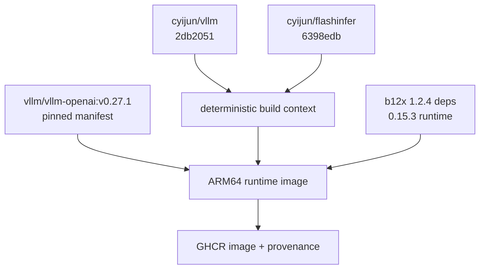

# 推理与构建架构

## 构建链路

容器以 vLLM 0.27.1 官方多架构镜像的固定 manifest digest 为二进制基线。构建过程中分别 checkout `cyijun/vllm` 和 `cyijun/flashinfer` 的完整 40 位 commit，把 vLLM Python 层、FlashInfer SM121 B12X/MLA JIT source 和 sparse-MLA binding overlay 到基线镜像。

这样做保留了基线镜像中的 ARM64 PyTorch/CUDA extension，同时使 DeepSeek-V4 的模型、quantization、DSpark、B12X 和 sparse MLA Python/JIT source 来自同一版本契约。

`config/versions.env` 是唯一固定版本入口。GitHub Action、local build、image label 和 deploy preflight 都消费这一契约。

## 服务链路

部署脚本直接启动两个 vLLM 进程：head 为 rank 0 并暴露 OpenAI-compatible API，worker 为 rank 1/headless。两端通过同一 RoCEv2 fabric 进行 NCCL/PyNCCL TP collective。

最终设计强制：

- tensor parallel size 2；
- pipeline parallel size 1；
- `distributed-executor-backend=mp`；
- 两节点本地模型 snapshot 内容一致；
- `max_num_seqs=6`；
- C6 target-verification 最大 decode batch 为 `6 × (MTP-5 + 1) = 36` token。

## 两条 checkpoint / KV 路径

| 路径 | 权重存储 | Target experts | Draft experts | KV 物理布局 | 用途 |
| --- | --- | --- | --- | --- | --- |
| Official aligned | dense/linear FP8 + routed MXFP4 | B12X W4A16 | B12X W4A16 | FP8 DS-MLA，584 B/token | 与 Anemll 的可比 control |
| NVFP4 deployment | NVFP4 checkpoint | packed NVFP4 → B12X W4A16 | 默认 Marlin，可切 B12X | 真 NVFP4 DS-MLA，288 B/token | 容量和真实 FP4 KV 验证 |

### 为什么 NVFP4 target 默认 W4A16 执行

权重仍保持 4-bit packed storage。W4A16 只改变 activation/GEMM execution：它避免每个小 decode expert batch 的 activation reduction、FP4 packing、中间 buffer 和 scale handling。routed `M=36` 的 checkpoint layer 测试中，W4A4 为 5.282 ms，W4A16 为 4.505 ms。

### `nvfp4_ds_mla` 名称歧义

本 fork 中的 `nvfp4_ds_mla` 是真实 288-byte packed FP4 row。Anemll 0.1.1 的同名选项在 DeepSeek-V4 路径实际分配 584-byte physical FP8 layout，并调用 FP8 insert/FlashMLA。报告始终把 API label 和物理 bits 分开描述。

## CUDA graph 策略

稳定配置使用 `FULL_DECODE_ONLY`，覆盖 5/6/24/25/30/36 等 target-verification shape。NVFP4 preset 对完整 12-token C2 shape 使用 eager，避免被 padding 到更大的、不稳定 graph shape。官方 aligned preset已验证 5/6/12/24/25/30/36，并预热 B12X route-pack capacity。

## 容器 Action

`build-container.yml` 仅接受手工触发或 `v*` tag，不接受 pull request。标准 `ubuntu-24.04-arm` job 负责 checkout 两个 fork 的 immutable commit、校验版本并打包 deterministic context；随后 `ARM64_BUILD_RUNNER` 指定的 runner 生成 `linux/arm64` image、OCI labels 和 build provenance，并可推送 GHCR。未配置该 repository variable 时，默认使用 `dgx-spark` 自托管标签。

不使用标准 GitHub ARM64 runner完成 CUDA 镜像 build，是因为其约 14 GB storage 不能可靠容纳约 20.6 GB 的 vLLM base image、build context 和 BuildKit cache。`validate.yml` 和 context preparation 可以安全地使用 `ubuntu-24.04-arm`。如果组织已配置 150 GB 或更大的 GitHub-hosted ARM larger runner，把其自定义 label 写入 `ARM64_BUILD_RUNNER` 即可替代 DGX Spark build runner。
